slidenumbers: true
autoscale: true
build-lists: true

[.header: #C01D04, text-scale(0.9)]

# The Rise of Object Store Architectures

### Ted Naleid (he/him)

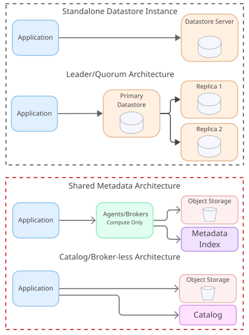

---

## Goals

#### Understand the industry shift in datastore architectures

#### Learn the tradeoffs of separating compute and storage

---

## The hardest thing about your application? <br/> <br/>

# Data/State

---

# Data/State

- is it durably persisted?
- is it available when you need it?
- are there race conditions?
- do you trust it?

---

## Traditional Datastore Architectures 
### compute tightly coupled with storage

# <br/>

## Object Store Architectures
### Compute and Storage Separated


---

### Motivating Distributed System Example <br/> 

## Apache Kafka

#### <br/> also true for Postgres, Casssandra, Mongo, Redis, etc
---

## Your App Publishes Events to Apache Kafka

## Topic Partitions: 1
## `replication.factor=1`

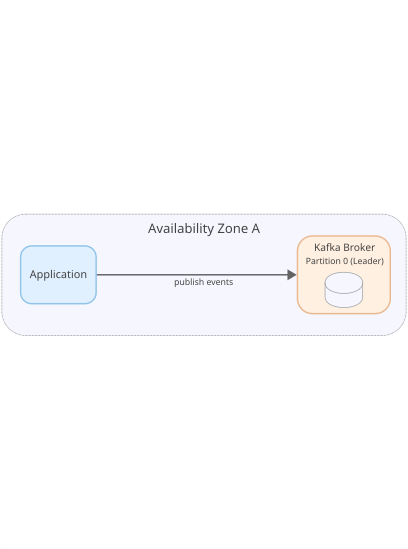

--- 

# Problem! 

## The server crashed!

## Data was lost!

## You care about your data; it's important


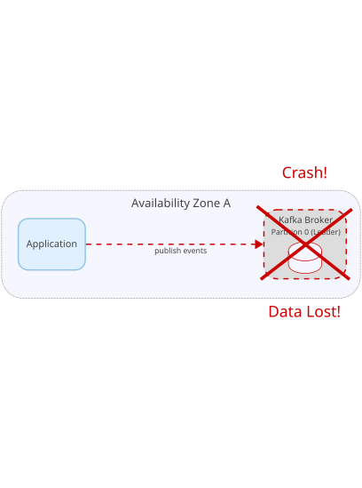

---

# Solution!

## Set the replication factor to `3` 

## Put brokers in multiple availability zones

## Ensure quorum with `min.insync.replicas=2` and `acks=all`

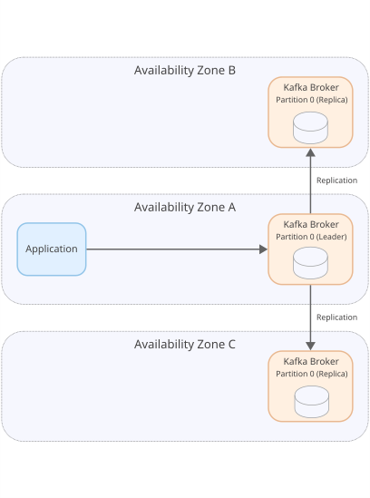

---

# Problem!

## Costs more than tripled

## 3x Compute and Storage costs

## Public Clouds charge (1¢/GB) for <br/> cross-availability zone data transfer

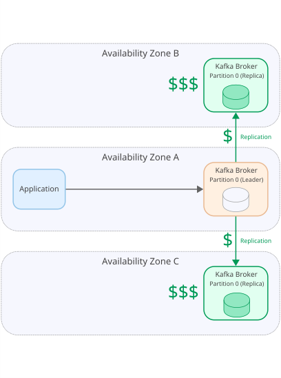

---

# Issue

## Traffic to your app is variable over time

## Sometimes unpredictably

## Required: peak traffic must be handled


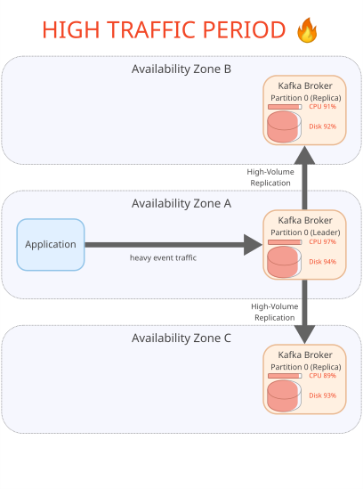

---

# Problem! 
 
### 95%+ of the time <br/> you're nowhere near peak

### autoscaling is hard, provision at maximum possible compute and disk

### there's no elasticity, so you're paying for what you don't need

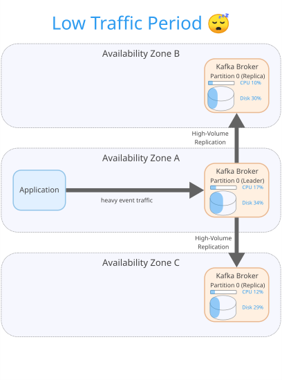

---

# Problem!

## One of the replicas has a noisy neighbor 

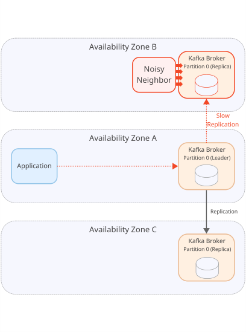


---

# Solution!

## Migrate that replica to another host 

## Hope the neighborhood is quieter

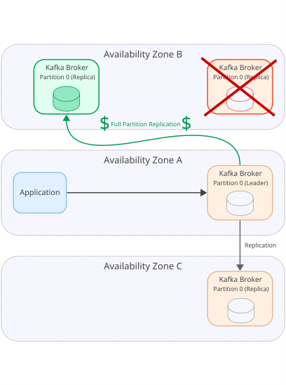

---

# Problem!

## Copying data can take hours

## Noisy transition for producers/consumers


---

## High Operational Complexity

### Upgrading versions takes hours and requires nodes to be pulled out of service

---


### When compute and storage are coupled, highly available systems are <br/> <br/>

## expensive, complicated, <br/>and inflexible

---

## What if we separated <br/> compute from storage?

---

## What if storage was unlimited and charged for what was actually used? 

---

## What if replication to other availability zones was free? 

---

# That's Object Storage

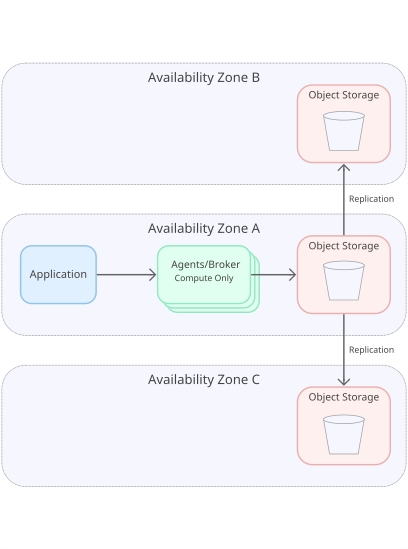


---

## Problems with tightly coupled compute and storage are solved

---

## Data is automatically replicated to multiple AZs

### 99.99% bucket uptime 
### 99.999999999% (11 nines) of durability

--- 

## 50-90% Lower Cost

### no cross-availability zone replication fees
### no need to run 3x compute for every write

---

## Elastic Compute and Infinite[^*] disk

- stateless servers quickly autoscale up/down
- server crashes/noisy neighbors quickly replaced
- new versions deploy in minutes instead of hours

[^*]: not actually ∞

---

## Object Storage Attributes

- Key/value store over HTTP APIs (s3 compatible) 
- GET/PUT/DELETE objects, list buckets
- Values can only be fully replaced/deleted
- Strong read-after-write guarantees

---

## Object Storage Attributes

- Buckets are spread across many servers
- Very high throughput
- Supports bucket versioning 
- Bucket lifecycle policies for TTL

---

# Incumbents are moving to object storage

- Amazon - Aurora and Dynamo DB 
- Confluent Kafka - Kora storage engine
- Datadog - Husky "3rd generation event store"
- InfluxDB 3.0 - Catalog + object store architecture
- ScyllaDB (Cassandra in C++) - backup, tiering

---

[.text: #333333, alignment:left]
## Startups are reinventing existing categories

| Category | Startups/Open Formats |
|----------|----------|
| Messaging/Kafka | AutoMQ, Bufstream, RS3, S2, StreamNative, WarpStream |
| Postgres | Neon, Nile |
| Telemetry/Observability | Bitdrift |
| Vector DB | Turbopuffer |
| Analytics | Apache Iceberg, Clickhouse, Databricks, Delta Lake, Rockset, Snowflake |

---

### SlateDB - New Database Primitive Library

#### LSM Tree backed by an object store

#### Object store version of RocksDB

#### Used by Nile and RS3

---

# <br/> Amazon launched S3 in 2006  <br/> <br/> 

> "malloc for the internet" - Jeff Bezos [original S3 spec](https://aws.amazon.com/blogs/aws/amazon-s3-path-deprecation-plan-the-rest-of-the-story/)

# <br/> <br/> Why are architectures changing now?

---

## Cloud Network Ratios Flipped

| year | Ethernet vs DDR % | Ethernet vs PCIe % |
|------|----------------------|--------------------|
| 2020 | 46% | 80% |
| 2023 | 260% | 167% |

> "memory located remotely across a network link can now be accessed with no penalty in throughput"

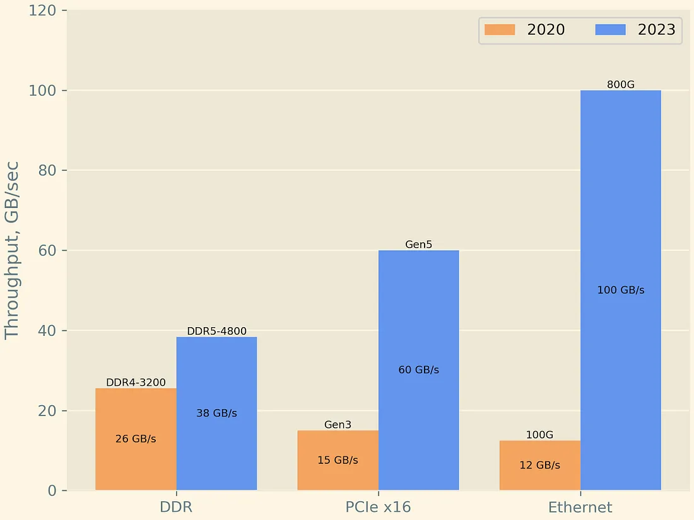

[.footer: source - https://blog.enfabrica.net/the-next-step-in-high-performance-distributed-computing-systems-4f98f13064ac ] 

---

## Conditional Writes added to S3 in 2024

PUT `If-None-Match: *` - object only written <br/> if it doesn't already exist

PUT `If-Match: <etag>` - object only overwritten if <br/> the current value has the given etag

### gives us CAS (Compare And Swap) semantics for concurrency

[.footer: https://aws.amazon.com/about-aws/whats-new/2024/08/amazon-s3-conditional-writes/ & https://aws.amazon.com/about-aws/whats-new/2024/11/amazon-s3-functionality-conditional-writes/ ] 
 

---

## Serverless Leader Election with Conditional Writes

[.column]
```
Acquire lock pseudocode:
1. Read lock 
2. If no lock use If-None-Match: *
   fencing_token = 1
3. Else use If-Match: <read etag>
   fencing_token = read token + 1
4. Put new lock with fencing_token
5. Return success/failure + fencing_token

Release lock pseudocode:
1. Read lock 
2. Verify fencing_token still matches our lock
3. Write lock with same token but expires_at=0
4. Use If-Match:<read etag>
5. Return success/failure
```

[.column]
```json
# lockfile owned till expires_at
{
  "expires_at": 1742229578,
  "fencing_token": 7 
}

# released `lockfile`
{
  "expires_at": 0,
  "fencing_token": 7 
}
``` 

[.footer: https://www.morling.dev/blog/leader-election-with-s3-conditional-writes/ + https://quanttype.net/posts/2025-02-25-leader-election-with-s3-and-if-match.html + https://github.com/slatedb/slatedb/blob/main/rfcs/0001-manifest.md#writer_epoch]


---

## TANSTAAFL

#### (there ain't no such thing as a free lunch)

---

## Object Store Costs

| Operation Type | Cost |
|----------------|------|
| Storage | 21¢-26¢/GB/month |
| PUT/POST/LIST | 5¢/10,000 API requests |
| GET/HEAD | 0.4¢/10,000 API requests |
| DELETE | Free |
| Within-AZ traffic | Free |


### Costs incentivize larger files/fewer requests

[.footer: https://cloud.google.com/storage/pricing & https://aws.amazon.com/s3/pricing/]

---

# Problem! Latency

| Architecture | p50 | p99 |
|----------------|------|---|
| Apache Kafka | ~10ms | ~50ms |
| Object Store Native | ~250ms | 500ms |

### Bad Use Cases: Emitting a synchronous event for every API call (use Outbox/CDC) or high-frequency trading style apps

--- 

### Pre-Cambrian explosion of new architectures built on object stores

---

## Shared Nothing Architecture

### Good for batchy workflows with significant latency tolerance

### Uses Compare And Swap (CAS) for appending new data to partition

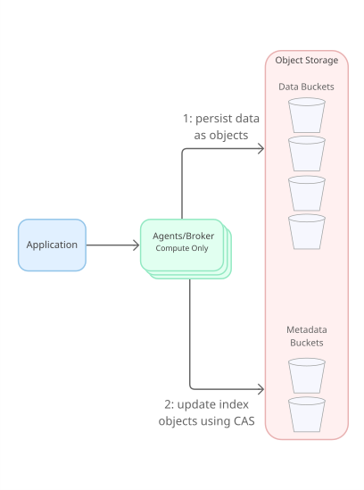

[.footer: more detail: https://blog.colinbreck.com/shared-nothing-architectures-for-server-replication-and-synchronization/]

--- 

## Shared Metadata Architecture

### Used by Warpstream and Bufstream

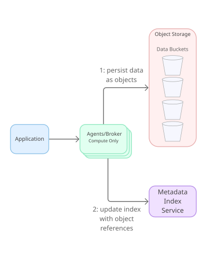

[.footer: more detail: https://www.warpstream.com/blog/the-case-for-shared-storage]

---

## Catalog/Broker-less Architecture

### Clients write directly to object store and "commit" to a catalog

### Used by many analytics products

### ex: Apache Iceberg

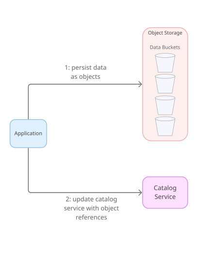

---

## Parallels with

### Object Oriented Programming <br/> (behavior tightly coupled with state)

### Functional Programming <br/> (pure functions separate from data)

---

#### The industry is shifting architecture to object stores

#### There are tradeoffs to this new architecture

### Cloud-Native Object Stores are architectural bedrock

---

# More Info

### Jack Vanlightly <br/> https://jack-vanlightly.com/
### Chris Riccomini <br/> https://materializedview.io/
### Alireza Sadeghi <br/> https://www.pracdata.io/

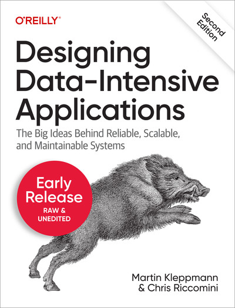

---
[.header: #C01D04, text-scale(0.9)]

## Questions?

#### <br/><br/><br/><br/>slides available at: <br/>  <br/> github.com/tednaleid/rise-of-object-store-architecture-presentation


